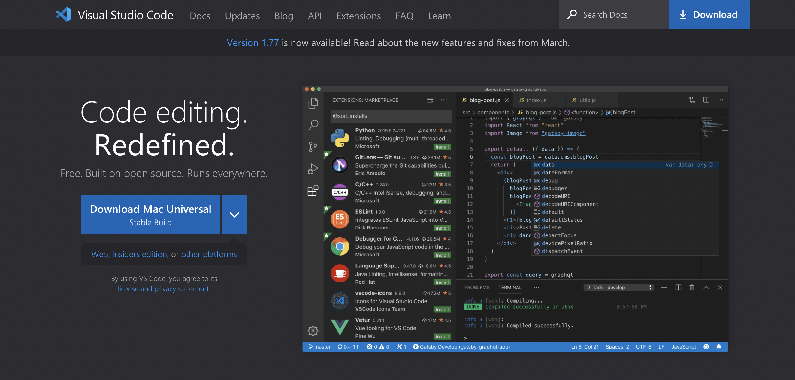
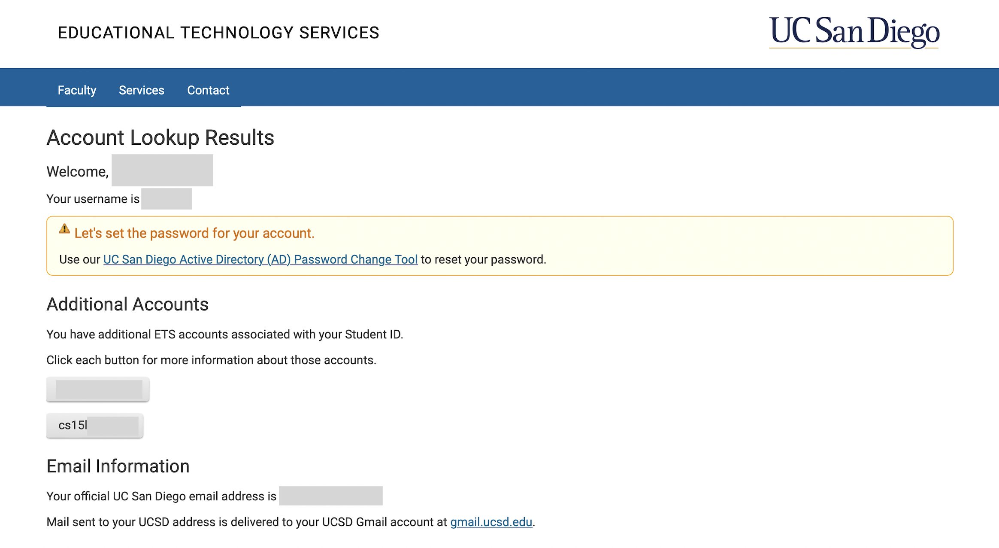
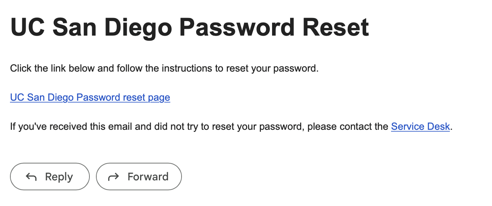

# Lab Report 1

## How to install VSCode: 


**Step 1:**

Click on this [link](https://code.visualstudio.com). 
It should send you to the Visual Studio Code webpage with an accessible download button. 
 

**Step 2:**

Click on the "Download Mac Universal" button. 
You can also click on the download button at the right corner of the page. This will take you to a page with options to choose from according to the device you are using. 


**Step 3:** 

After clicking on the button, you will see a page that says, "Thanks for downloading VS Code for *(your device)*". 
On the left, there will be multiple links you can click on to learn more about the application. 
Click on "SETUP" and choose the type of device you are downloading the application on. 


**Step 4:** 

From there, follow the instructions to complete your installation. 
When it is installed successfully, you should be able to open a window like the following images. *(Note: the colors and menu bar could be different depending on your own settings)*
 
 

## How to log into a course-specific account on ieng6 (Remotely Connecting):

**Step 1:**

Click on this [link](https://sdacs.ucsd.edu/~icc/index.php) to look up your course-specific account for CSE15L. 
The link should send you to a page like the one in the following image. Type in your username and student ID. 
 

**Step 2:** 

When your account lookup results page shows up, under the heading "Additional Accounts", click on the button that starts with "cs15l". Then, you should see a different notification or alert to set the password for your account.  
 
 

**Step 3:**

Click on the "Global Password Change Tool" link. If you see a page that says that the application has been retired, click on the link under "Student, AX, or Course-Specific Student Accounts". 


**Step 4:** 

Enter your username in the AD Password Change Tool. The username should be the button that you clicked in step 3; it starts with "cs15l" followed by the quarter, year, and two personal letters. 
 

**Step 5:**

On the next page, click on the link that says, "I want to reset my course-specific account password". This will lead you to the Duo Multi-Factor Authentication page. Proceed with logging in. 
 

**Step 6:** 

You will then have to confirm your email address to receive password reset instructions; click "Yes". Check your email and click on the first link in the email. 

 

**Step 7:** 

Then, you will be led to a page where you can enter your new password. Once you have completed that, you should see a page with a message that your password change was successful. Click on the "Finish Password Setup" button in that page. 


***Important: wait for about 15 minutes or more before continuing the next steps.*** 

**Step 8:**

Open VSCode. On the menu bar at the top, click on "Terminal" and "New Terminal". 

**Step 9:**

Type and enter `ssh cs15lsp23zz@ieng6.ucsd.edu`. The `cs15lsp23zz` or mainly just `sp23zz` should be replaced with your own username. 
*(Note: The letter after 15 is a lower-case L.)* 
***(Additional Note: I believe there are additional steps for windows to be able to do this.)***   

**Step 10:**

You will then receive a message that says: 
```
⤇ ssh cs15lsp23zz@ieng6.ucsd.edu
The authenticity of host 'ieng6.ucsd.edu (128.54.70.227)' can't be established.
RSA key fingerprint is SHA256:ksruYwhnYH+sySHnHAtLUHngrPEyZTDl/1x99wUQcec.
Are you sure you want to continue connecting (yes/no/[fingerprint])?
```
Type `yes` and press enter. 

**Step 11:**

Enter your password *(the new password you changed to during the earlier steps)*. You will not be able to see anything as you type; this is normal. Try your best to correctly enter your password. You should see a long message including your last log in date and time. This means that you have successfully connected remotely. *(Note: you can type `exit` or Ctrl-D to log out of the remote server in the terminal.)*
 

## Trying Some Commands: 
In the terminal, try running the following commands in different ways: `cd`, `ls`, `pwd`, `mkdir`, and `cp`. 
You can try them both on your computer and on the remote computer. 

Some examples given by the professor: 
* `cd ~`
* `cd`
* `ls -lat`
* `ls -a`
* `ls <directory>` where `<directory>` is `/home/linux/ieng6/cs15lsp23/cs15lsp23abc`, where the `abc` is another student’s username
* `cp /home/linux/ieng6/cs15lsp23/public/hello.txt ~/`
* `cat /home/linux/ieng6/cs15lsp23/public/hello.txt`

 


