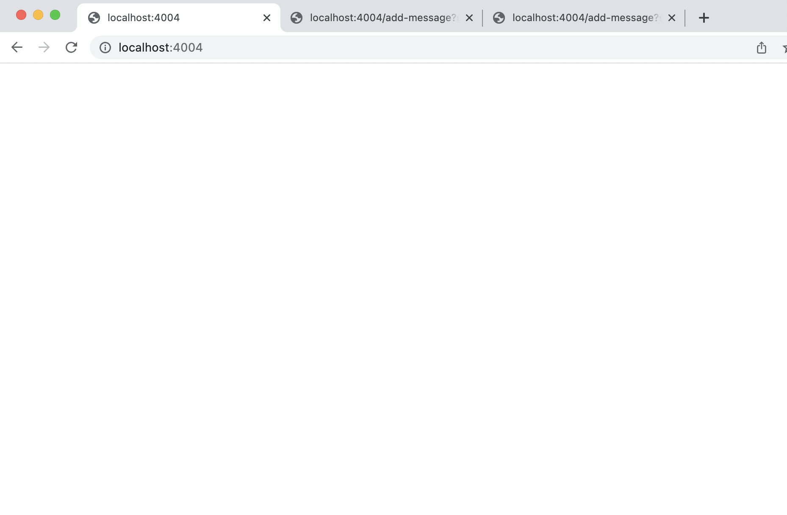
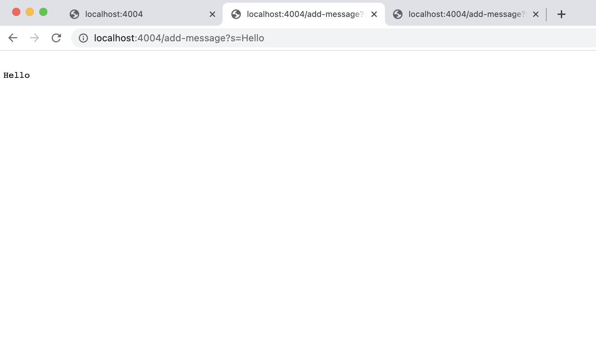
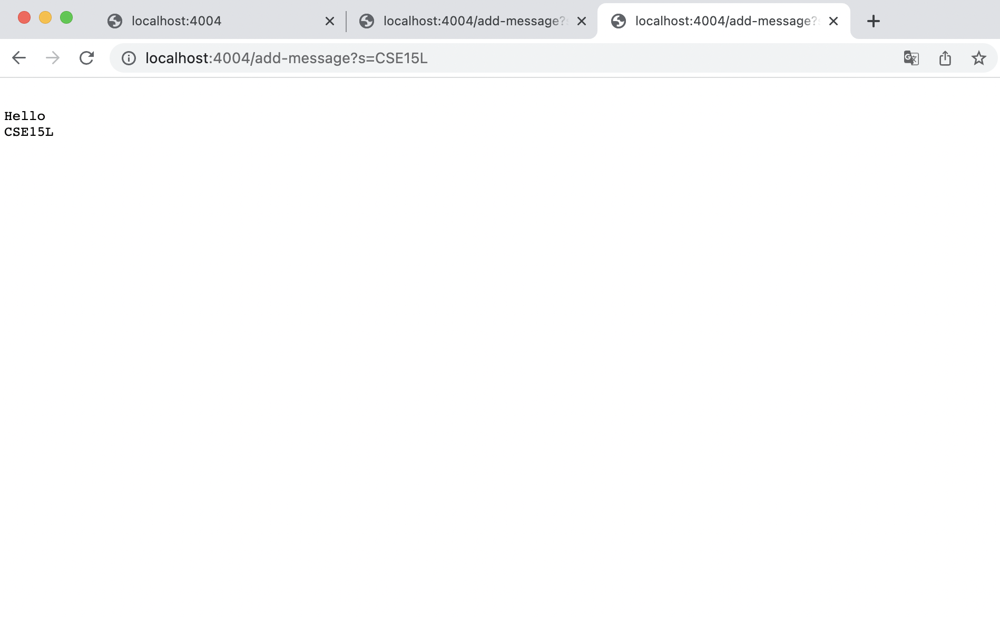
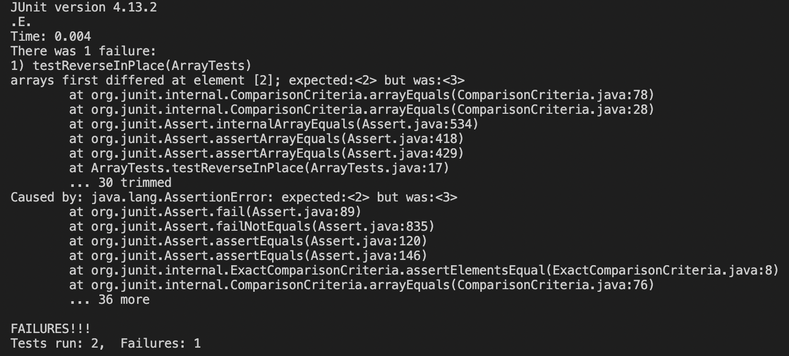

# Lab Report 2

## Part 1

**My code for StringServer.java :**

```
import java.io.IOException;
import java.net.URI;

class Handler implements URLHandler {
    static String s = "";

    public String handleRequest(URI url) {
        if (url.getPath().equals("/")) {
            return s;
        } 
        else if (url.getPath().equals("/add-message")) {
            String query = url.getQuery();
            String[] parameters = query.split("=");
            if(parameters[0].equals("s")){
                s +=  "\n" + parameters[1];
            } 
            return s;
        } 
        return "404 Not Found!";
    }
}

class StringServer {
    public static void main(String[] args) throws IOException {
        if(args.length == 0){
            System.out.println("Missing port number! Try any number between 1024 to 49151");
            return;
        }

        int port = Integer.parseInt(args[0]);

        Server.start(port, new Handler());
    }
}
```
---

**Screenshots of using /add-message :** 





**For the screenshot with http://localhost:4004/add-message?s=Hello:**

The method that was called from my code was the `handleRequest` method from the `Handler` class. The `handleRequest` allows the message to be added to an empty page while trying to determine what the string in the url is. In this case, instead of just http://localhost:4004/ , we are utilizing http://localhost:4004/add-message?s=Hello and so the `else if` condition in the handleRequest method would have ran and produced the string in the page. I edited the NumberServer.java code from lab 2 to make this, so most of the code remains the same.

For the `handleRequest` method, the url is a relevant argument as well as the "/" and "/add-message" part of the url. In the `Handler` class, `s` would have the value of an empty string and `parameters` would have the value of an array ["s", "Hello"]. 

Because of this specific request, the values of any relevant fields of the class do change. The `s` would change and have the value of "\nHello" instead of just an empty string. 


**For the screenshot with http://localhost:4004/add-message?s=CSE15L:**

Similarly, the method that was called from my code was the `handleRequest` method from the `Handler` class. 

For the `handleRequest` method, the url is a relevant argument as well as the "/" and "/add-message" part of the url. In the `Handler` class, `s` would have the value of "\nHello" and `parameters` would have the value of an array ["s", "CSE15L"]. 

Because of this specific request, the values of any relevant fields of the class do change. The `s` would change and have the value of "\nHello\nCSE15L" instead of just "\nHello".

## Part 2

Regarding the bug for reverseInPlace: 
1. A failure-inducing input for the buggy program would be: 

```
@Test
public void testReverseInPlace(){
	int[] input = {1,2,3,4};
	ArrayExamples.ReverseInPlace(input);
	assertArrayEquals(new int[]{4,3,2,1}, input);
}
``` 

2. An input that doesn't induce a failure: 

```
@Test
public void testReverseInPlace1(){
    int[] input2 = {1};
    ArrayExamples.reverseInPlace(input2);
    assertArrayEquals(new int[]{1}, input2);
}
```
3. The symptom (screenshot): 


4. The bug:

The code before- 
```
static void reverseInPlace(int[] arr) {
    for(int i = 0; i < arr.length; i += 1) {
      arr[i] = arr[arr.length - i - 1];
    }
}
```
The code after - 
```
static void reverseInPlace(int[] arr) {
    int [] args = new int[arr.length];
    for (int i = 0; i < arr.length; i += 1) {
      args[i] = arr[arr.length - i - 1];
    }
    for (int i = 0; i < arr.length; i += 1) {
      arr[i]=args[i];
    }
}
```

The issue with the code before was that when the array {1,2,3,4} was added, the array differed at element [2] where the expected was 2, but the output was 3. 
The code was using the array that was in the process of being reversed, which was why the output was three for element [2]. 
In order to fix this, we could create a new int array that the reversed values would go into and then, change the values of arr using a for loop after that process is completed. 
By creating a new int array, and doing `args[i] = arr[arr.length - i - 1]` in the for loop, the program would still be using {1,2,3,4} or the given array since we haven't made any changes to arr yet. 

## Part 3

Some thing I learned from week 2 and week 3 would be implementing a web server. For lab 2 and this lab report, we had to write a web server according to certain requests and because it was completely new to me, I had to rely heavily on lab 2 and the code in NumberServer.java. It was pretty interesting to use the server and try to get different results by changing the path or query. 


