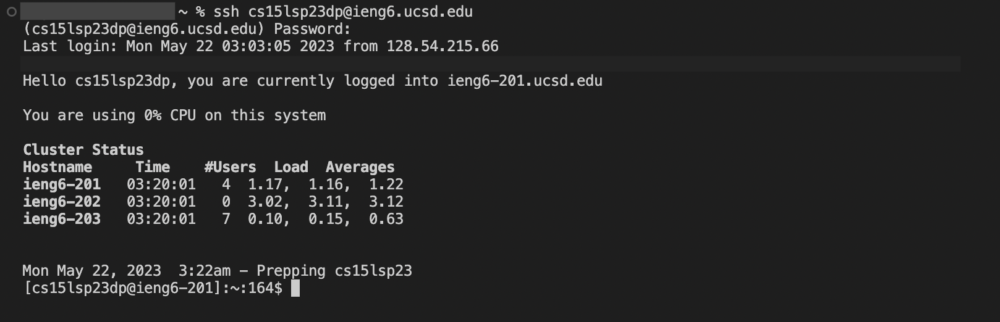
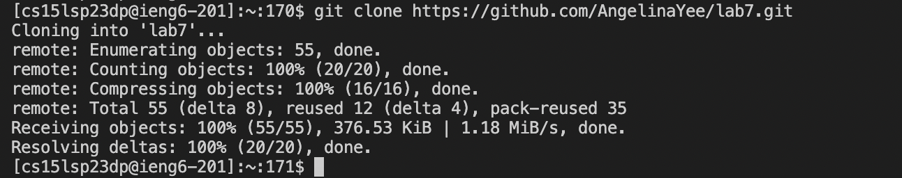
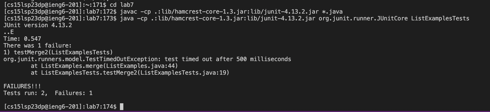
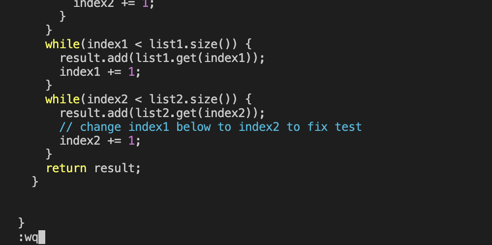
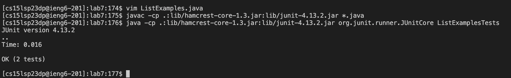
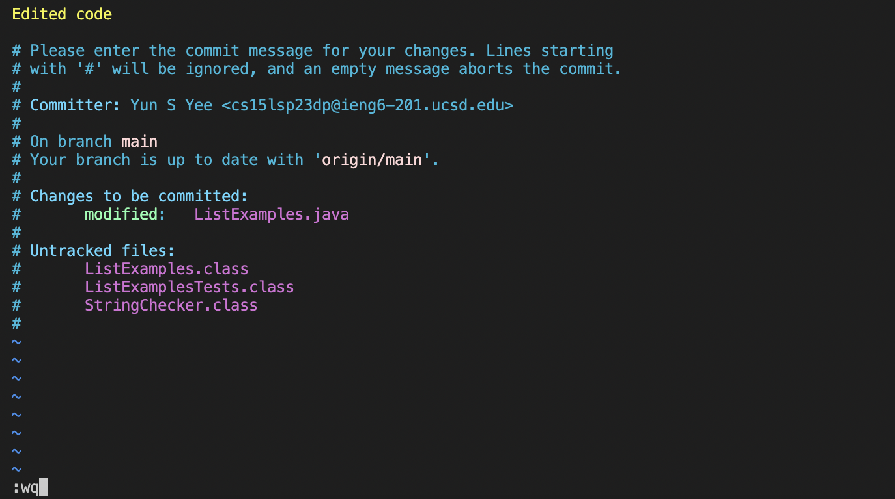
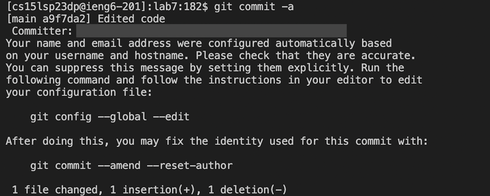

# Lab Report 4 #
**Step 4- Logging in to ieng6:** 

Keys Pressed: `ssh cs15lsp23()@ieng6.ucsd.edu`
Then, the password was entered. `<Enter>`

This step is to connect remotely with the ieng6 account. 

**Step 5- Clone your fork:** 

Keys Pressed: `git clone https://github.com/AngelinaYee/lab7.git` `<Enter>`
I forked the previously given repository and copied the link prior to this. 

**Step 6- Run the test, demonstrating that they fail:**

Keys Pressed: I changed the directory first using: `cd lab7` `<Enter>`, then 

`javac -cp .:lib/hamcrest-core-1.3.jar:lib/junit-4.13.2.jar *.java` `<Enter>` and

`java -cp .:lib/hamcrest-core-1.3.jar:lib/junit-4.13.2.jar org.junit.runner.JUnitCore ListExamplesTests` `<Enter>`

After pressing these keys and entering the commands, the tests clearly return with errors. 

**Step 7- Edit the code:**

Keys Pressed: `vim ListExamples.java`
`<up><up><up><up><up><up>` then, `<right>` 11 times to get to the text that I want to edit, which is "index1". The cursor should be to the right of the number 1. 
Then, I pressed, `<i>`, `<delete>`, `<2>`, and `esc`. 
To save the edited filed, I entered: `:wq` and pressed `<Enter>`. 

**Step 8- Run the tests:**

Keys pressed: `javac -cp .:lib/hamcrest-core-1.3.jar:lib/junit-4.13.2.jar *.java` `<Enter>` and

`java -cp .:lib/hamcrest-core-1.3.jar:lib/junit-4.13.2.jar org.junit.runner.JUnitCore ListExamplesTests` `<Enter>` 
After doing so, all the tests passed, meaning we fixed the code. 

**Step 9- Commit and push:**

Keys pressed: `git commit -a` 
After doing so, I had to write a description and I pressed the keys: `<i>` and typed my description. Then, I pressed `<Enter>` to leave a space. 
Finally, I entered `:wq` to save and exit.

