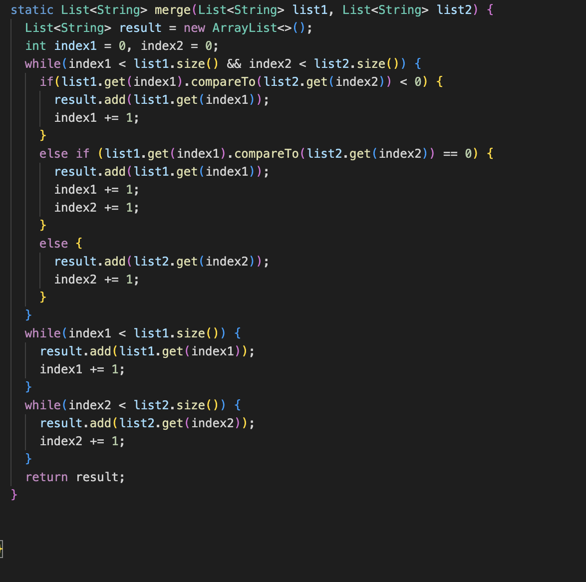

# Lab Report 5 # 

## The student's post ## 
### What environment are you using (computer, operating system, web browser, terminal/editor, and so on)? ###

I am using the VS code application on my computer. 

### Detail the symptom you're seeing. Be specific; include both what you're seeing and what you expected to see instead. Screenshots are great, copy-pasted terminal output is also great. Avoid saying “it doesn't work”. ###

When there is a duplicate in the list, merge does not return the duplicates. 
For example, if I include "b" once in left and once in right, the expected should return both of them in a list, but it only returns one of them. 
In the image below, the first test fails while the second test passes.(The second test is there for comparison only). 

I was thinking that there was a problem with my merge method, but I included statements to check for when the element is the same. 

### Detail the failure-inducing input and context. That might mean any or all of the command you're running, a test case, command-line arguments, working directory, even the last few commands you ran. Do your best to provide as much context as you can. ###

I simply compiled the files and ran them with: 

javac -cp .:lib/hamcrest-core-1.3.jar:lib/junit-4.13.2.jar *.java

and 

java -cp .:lib/hamcrest-core-1.3.jar:lib/junit-4.13.2.jar org.junit.runner.JUnitCore ListExamplesTests 

## Response from TA ## 
I would suggest for you to reconsider the else if statement.
What is the function of the else if statement and check if it is redundant with the else statement. 
Pay close attention to what it is adding into result as well. 

## Result ##

The bug was the else if statement. 
It makes it so that only elements from from list1 are added into result which could be the reason why both the duplicates aren't present.
So, it basically skips list2 and only ends up adding one of the duplicated elements into result. 
  
## Additional Information ## 
### Files needed: ###

The ListExamples.java and ListExamplesTests.java files were needed, with appropriate imports. 
  
### Commands used to compile and run the tests(showed the failed test): ###
  
javac -cp .:lib/hamcrest-core-1.3.jar:lib/junit-4.13.2.jar *.java

java -cp .:lib/hamcrest-core-1.3.jar:lib/junit-4.13.2.jar org.junit.runner.JUnitCore ListExamplesTests
  
### Content of file before fixing the bug: ###

  
### What to edit to fix the bug: ###

Remove the else if statement in ListExamples.java. 

### We can test the code by forking and cloning https://github.com/ucsd-cse15l-s23/grader-skill-demo2.git and using bash like so: ###
  
`$ bash grade.sh (the repository link of the student's submission)`
  
This should let us know whether the autograder recognizes that the bug has been fixed or not. 

## Reflection ##
I thought that the autograder set up was really interesting because I have always been curious about how our programming assignments were checked and scored. 
Even though it was pretty complicated, I still enjoyed it and I do wonder how complex it could get. 
